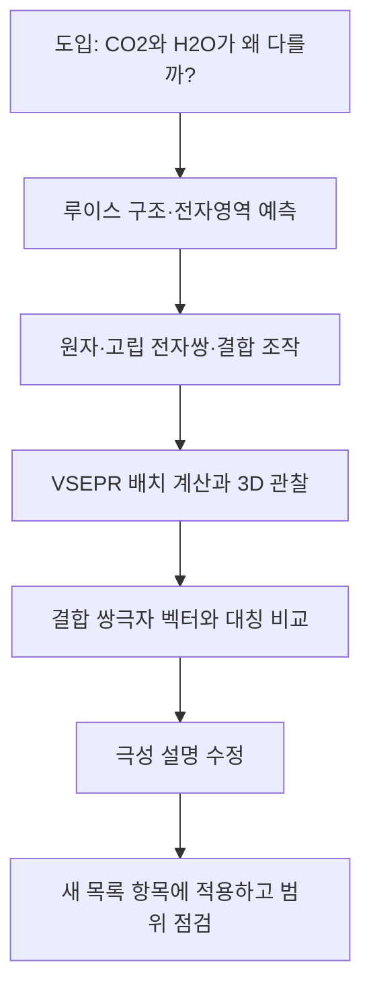

# 08. 분자의 건축가

> 작성일: 2026-09-10 · 상태: 제작 전 설계 초안 v0.1  
> 상위 문서: [전체 목록](README.md) · [공통 설계 기준](00-shared-design-principles.md)

## 1. 제품 목표

학생이 검수된 12개 분자의 결합 연결, 전자영역, 분자 기하, 대칭을 조립하고 결합 극성과 분자 전체 쌍극자를 구분해 설명합니다.

MVP는 VSEPR 기반의 교육 모형입니다. 실제 전자밀도, 양자화학 계산, 분자 궤도, 반응성 또는 범용 물성 예측은 포함하지 않습니다.

분자 배치는 계산된 양자 상태가 아니라 이상화한 교육용 기하입니다. 각 카드에 “VSEPR 이상화”와 “문헌 대조 상태”를 함께 표시합니다.

## 2. 권장 대상과 선수 개념

- 권장 학년: 고등학교 화학
- 권장 차시: 50분 1차시
- 선수 개념: 원자가전자, 공유결합, 루이스 구조, 전기음성도, 벡터의 합
- 선택 선수 개념: 전자쌍 반발, 점군 대칭의 기초, 3차원 좌표
- 교육적 경계: 앱의 극성 판정은 이상화된 구조와 방향성 규칙에 대한 학습용 판정

## 3. 12분자 검수 목록

아래 목록은 MVP의 검수 대상 12개입니다. 화학식·종 식별은 NIST Chemistry WebBook SRD 69와 대조하고, 전자영역·분자 기하는 VSEPR 교육 자료와 교과 검토로 확정합니다.

| ID | 분자 | 중심 원자 | 전자영역 기하 | 분자 기하 | 결합 극성-전체 극성 |
|---|---|---|---|---|---|
| M01 | CO₂ | C | 선형 | 선형 | 극성 결합, 전체 비극성 |
| M02 | H₂O | O | 정사면체 전자영역 | 굽은형 | 극성 결합, 전체 극성 |
| M03 | BF₃ | B | 삼각 평면 | 삼각 평면 | 극성 결합, 전체 비극성 |
| M04 | NH₃ | N | 정사면체 전자영역 | 삼각뿔형 | 극성 결합, 전체 극성 |
| M05 | CH₄ | C | 정사면체 | 정사면체 | 약한 결합 극성 모형, 전체 비극성 |
| M06 | SiCl₄ | Si | 정사면체 | 정사면체 | 극성 결합, 전체 비극성 |
| M07 | BeCl₂ | Be | 선형 | 선형 | 극성 결합, 전체 비극성 |
| M08 | SO₂ | S | 삼각 평면 전자영역 | 굽은형 | 극성 결합, 전체 극성 |
| M09 | PCl₅ | P | 삼각쌍뿔 | 삼각쌍뿔 | 극성 결합, 전체 비극성 이상화 |
| M10 | SF₆ | S | 팔면체 | 팔면체 | 극성 결합, 전체 비극성 |
| M11 | ClF₃ | Cl | 삼각쌍뿔 전자영역 | T자형 | 극성 결합, 전체 극성 |
| M12 | XeF₄ | Xe | 팔면체 전자영역 | 평면 정사각형 | 극성 결합, 전체 비극성 |

M07(BeCl₂)과 M09(PCl₅)은 기체상 단량체·이상화 조건을 카드에 명시합니다. 이온의 총전하와 쌍극자 원점 문제는 후속 목록으로 분리합니다.

## 4. 학습 목표

학생은 다음을 할 수 있어야 합니다.

1. 루이스 구조에서 중심 원자와 결합 전자영역·고립 전자쌍을 세어 입체수 후보를 만든다.
2. 전자영역 기하와 실제 원자 배치인 분자 기하를 구분한다.
3. 분자 배치를 회전해 대칭 요소와 상쇄되는 결합 쌍극자를 찾는다.
4. 결합 극성이 있다고 전체 분자가 반드시 극성인 것은 아님을 설명한다.
5. idealized VSEPR 배치와 실험·문헌 기하의 역할을 구분한다.
6. 12개 목록에서 새로운 분자에 자동 일반화하지 않고 모델의 범위를 말한다.

## 5. 오개념과 교정 장치

| 오개념 | 반례 | 피드백 |
|---|---|---|
| 극성 결합이 있으면 분자도 극성이다 | CO₂, BF₃, SiCl₄, SF₆ | “결합 벡터의 방향 합을 보세요.” |
| 전자영역 기하와 분자 기하는 항상 같다 | H₂O, NH₃ | “고립 전자쌍을 원자 위치로 세지 않습니다.” |
| 화면에서 대칭적으로 보이면 실제 전하도 완벽히 같다 | 교육 모형과 문헌 구분 | “이 화면은 방향성 교육 모형입니다.” |
| 이온은 쌍극자가 무조건 없다 | 전하와 쌍극자의 정의 비교 | “전체 전하와 쌍극자 벡터는 다른 질문입니다.” |
| 막대 길이가 실제 결합 길이 측정값이다 | 이상화 카드 | “표시는 비교용 스케일이며 측정값이 아닙니다.” |

## 6. 한 차시 흐름

| 시간 | 활동 | 증거 |
|---:|---|---|
| 0~6분 | CO₂·H₂O의 극성 예측 | 결합과 전체를 나눈 문장 |
| 6~15분 | 루이스·전자영역 입력 | 고립 전자쌍 수 |
| 15~28분 | 과제 1: 형태 만들기 | 기하 이름과 근거 |
| 28~39분 | 과제 2: 대칭 탐색 | 벡터 상쇄 표시 |
| 39~47분 | 과제 3: 결합/전체 극성 | 반례 비교표 |
| 47~50분 | 출구 티켓 | 모델 범위 문장 |

## 7. 최소 과제

### 과제 1: 전자영역 건축

- 대상: H₂O, NH₃, CH₄ 중 하나
- 학생 행동: 중심 원자에 결합과 고립 전자쌍을 배치하고 실행
- 기대 결과: H₂O 굽은형, NH₃ 삼각뿔형, CH₄ 정사면체
- 회복: 전자영역 수와 원자 위치 수를 색이 아닌 아이콘으로 대조

### 과제 2: 대칭으로 지우기

- 대상: CO₂, BF₃, SF₆, XeF₄
- 학생 행동: 각 결합 쌍극자 화살표를 표시하고 순벡터가 0인지 예측
- 기대 결과: 대칭 배치의 전체 쌍극자 0, 결합 극성과 구분
- 오답 후에는 벡터 한 쌍만 숨겨 부분 합을 재시도

### 과제 3: 극성 결합이 있는 분자들의 전체 극성 비교

- 대상: CO₂ 대 SO₂, NH₃ 대 BF₃
- 학생 행동: 중심 원자 주변 배치를 바꾸지 않고 고립 전자쌍·대칭 차이를 설명
- 기대 결과: 굽은형·삼각뿔형은 상쇄되지 않는 방향 성분을 남김
- 제한: 실제 쌍극자 크기 숫자나 용매 효과는 다루지 않음

### 선택 과제: 목록 밖 질문

- 학생이 새 화학식을 입력하면 “MVP 목록 밖”으로 중단하고, 교사가 검수할 데이터 항목을 제안
- 런타임 AI가 구조나 정답을 생성하지 않음

## 8. 화면과 조작

- 상단: 분자명·화학식·`VSEPR 이상화` 배지·작은 `업데이트 내역` 버튼
- 중앙: 계산된 구-막대 분자, 결합 쌍극자 화살표, 평면 대칭 가이드
- 조작판: 12분자 카드, 중심 원자 선택, 고립 전자쌍 토글, 벡터 표시 토글, 회전 프리셋
- 결과판: 전자영역 기하, 분자 기하, 결합 극성, 전체 극성, 근거 문장
- 필수 버튼 `구조 적용` 하나만 `gi-pulse` 아우라로 강조
- 모션 감소에서는 자동 회전을 끄고 정면·측면·위 스냅샷 세 장으로 비교
- 밝은 테마를 유지하며 VoiceOver 구현·검증은 범위에서 제외합니다. 키보드, 초점, 텍스트 대안과 모션 감소는 검증 대상입니다.
- 색상만으로 원소·극성을 구분하지 않고 기호, 결합선, 화살표 방향, 표를 병기
- 키보드로 카드 이동, 고립 전자쌍 수 조절, 시점 프리셋 이동 지원
- 좁은 화면에서는 분자 구조와 결과 표를 먼저 보이고 카드 목록은 가로 스크롤 없이 줄바꿈

## 9. 상태·입력·출력·단위·경계

### 상태

`moleculeId`, `connectivity`, `centralAtom`, `bondDomains`, `lonePairs`, `idealGeometry`, `bondDipoleDirections`, `netDipoleClass`, `evidence`, `runHistory`, `reducedMotion`을 세션 메모리에서 관리합니다. 런타임 AI 호출·계정·영구 저장은 사용하지 않습니다.

### 입력과 출력

- 입력: 검수 목록에서 분자 선택, 결합·고립 전자쌍 배치, 방향 프리셋, 설명 선택
- 출력: 전자영역 수, 분자 기하, 이상화 좌표, 결합 극성의 질적 방향, 순 쌍극자 분류
- 단위: MVP는 각도(도)와 상대 길이만 표시하고 쌍극자 크기는 수치 단위로 출력하지 않음
- 좌표: 이상화 정규화 좌표를 사용하며 결합 길이 절대값은 측정치가 아님

### 분류 알고리즘

1. 목록의 연결성과 중심 원자, 형식 전하를 확인한다.
2. `stericNumber = sigmaBondDomains + lonePairDomains`를 계산한다.
3. 입체수와 고립 전자쌍 수로 VSEPR 전자영역 기하와 분자 기하를 조회한다.
4. 검수된 이상화 좌표를 배치하고 화면에 교육용 모형 배지를 표시한다.
5. 화학 결합 극성 화살표는 관례상 `δ+ → δ−`(전기음성도가 큰 쪽으로)로 표시하고 시작점에 작은 십자를 둔다.
6. 물리학의 전기 쌍극자 모멘트 `p`는 IUPAC 정의에 따라 음전하에서 양전하 방향인 `− → +`로 별도 표시한다. 두 화살표의 기호와 방향을 하나로 재사용하지 않는다.
7. 대칭 축과 결합 쌍극자 벡터 합 규칙으로 `netDipoleClass`를 `zero` 또는 `nonzero`로 정한다.
8. 문헌 대조 메모와 계산 결과를 함께 표시한다. 이는 양자계산이 아니다.

### 경계

- 목록 밖 화학식, 불완전 루이스 구조, 원자가 전자 수 불일치는 실행하지 않습니다.
- 고립 전자쌍의 실제 각도 왜곡, 공명, 혼성 오비탈의 엄밀한 해석은 “후속 검토”로 표시합니다.
- 결합 극성과 전체 극성을 하나의 체크박스로 합치지 않습니다.
- 결합 길이·각도는 이상화 값이며 실험 정밀 측정값으로 표시하지 않습니다.
- 기능별 코드는 한 파일 500줄 미만을 목표로 분리합니다.

## 10. Three.js 역할

- 구·막대의 교육용 3D 배열과 회전, 선택 원자 강조를 담당합니다.
- 결합 쌍극자 화살표를 각 결합 방향에 맞춰 표시합니다.
- 대칭 가이드 평면과 회전 프리셋을 제공하지만 분자 동역학은 계산하지 않습니다.
- 화학 분류·벡터 합·검수 메타데이터는 Three.js와 독립된 엔진에 둡니다.
- WebGL이 없을 때 2D Lewis 구조, 기하 카드, 표로 동일한 설명을 제공합니다.

## 11. Images 2.5 자산 계획

분자 구조와 쌍극자 화살표는 계산 렌더링입니다. 생성 이미지는 교실 맥락·카드 장식에만 사용합니다.

| 종류 | 예상 수량 | 기준과 변형 |
|---|---:|---|
| 분자 설계 스튜디오 배경 | 1 | 밝은 책상·모형 구·카드, 텍스트 없음 |
| 원소 재료 카드 배경 | 12 | 동일 레이아웃, 색과 추상 질감만 변형 |
| 대칭 탐구 안내 삽화 | 3 | 선형·평면·입체 대칭의 맥락, 구조는 코드 렌더링 |
| 도움말 아이콘 | 6 | 결합·고립쌍·대칭·극성·이온·한계 |

프롬프트 1: “bright molecular design studio for high school chemistry, colorful abstract atom spheres on a clean desk, white and cyan classroom palette, no labels, no formulas, educational illustration”.

프롬프트 2: “same molecular design studio composition, vary only the abstract arrangement card for linear, bent, trigonal planar, tetrahedral, and octahedral concepts, no text, no precise scientific diagram”.

검수는 생성 이미지가 실제 분자 구조 또는 극성의 증거로 오해되지 않는 캡션, 글자 왜곡 없음, 코드 렌더링과 시각적 일관성을 확인합니다.

## 12. 피드백과 성취 증거

- 피드백 순서는 중심 원자 → 전자영역 → 원자 배치 → 결합 벡터 → 전체 벡터입니다.
- “극성 결합 있음”을 골랐다고 전체 극성 정답으로 처리하지 않습니다.
- 성취 증거는 두 개의 대조 분자, 대칭 벡터 표시, 이상화 범위 문장입니다.
- 상태는 `구조세움/기하설명/결합극성구분/전체극성설명/전이`로 기록합니다.
- 자동 AI 채점 대신 선택 근거와 교사 관찰 메모 칸을 제공합니다.

## 13. 모듈과 데이터 구조

- `domain/moleculeTypes.ts`: 분자·전하·기하·검수 상태
- `engine/vsepr.ts`: 입체수·분자 기하 조회
- `engine/dipoleQualitative.ts`: 방향 벡터와 대칭 상쇄
- `scenarios/moleculeCatalog.ts`: 12분자 고정 목록과 출처 ID
- `renderers/moleculeScene.ts`: Three.js 교육 모형
- `components/MoleculeCardGrid.tsx`: 목록과 선택
- `components/PolarityEvidence.tsx`: 근거·설명·업데이트 내역

예시 구조는 `{ id, formula, charge, centralAtom, sigmaDomains, lonePairs, electronGeometry, molecularGeometry, bondPolarity, netDipoleClass, idealCoordinates, sourceIds, reviewStatus }`입니다.

## 14. MVP와 후속

MVP는 12개 목록, VSEPR 조회, 이상화 좌표, 결합·전체 극성 구분, 대칭 회전, 세 과제, 세션 상태, 밝은 테마, 키보드·모션 감소·2D 대체 화면입니다.

후속은 이온과 총전하의 쌍극자 원점 문제, 공명·다중 중심 원자, 실제 결합각 데이터 비교, 점군 대칭 심화, 기초 양자화학 결과를 별도 검수하는 범위입니다. 범용 분자 물성 예측과 런타임 AI는 추가하지 않습니다.

## 15. 검증 사례

아래는 구현 후 실행할 제안 사례이며 통과 결과가 아닙니다.

| 사례 | 입력 | 기대 결과 |
|---|---|---|
| V1 선형 상쇄 | CO₂ | 선형, 결합 극성 있음, 전체 비극성 이상화 |
| V2 굽은형 | H₂O | 굽은형, 결합·전체 극성 |
| V3 삼각 평면 상쇄 | BF₃ | 삼각 평면, 전체 비극성 이상화 |
| V4 삼각뿔형 | NH₃ | 삼각뿔형, 전체 극성 |
| V5 정사면체 상쇄 | CH₄ | 정사면체, 전체 비극성 이상화 |
| V6 정사면체 상쇄 | SiCl₄ | 극성 결합, 전체 비극성 이상화 |
| V7 T자형 | ClF₃ | T자형, 전체 극성 |
| V8 평면 정사각형 | XeF₄ | 평면 정사각형, 전체 비극성 이상화 |
| V9 목록 밖 | 임의 화학식 | 실행 중단, 목록 밖 안내 |

좌표 반올림, 벡터 상쇄 임계값, GPU 성능, 분자 목록의 교과서 정합성은 프로토타입과 교과 검토 후 확정합니다.

## 16. 위험과 미결정

- 위험: 이상화 구-막대가 실제 전자밀도처럼 보일 수 있음 → 모형 배지와 단위 없는 스케일 표시
- 위험: 전기음성도 방향만으로 정량 쌍극자를 추정할 수 없음 → 질적 분류로 제한
- 위험: 이온과 분자를 같은 언어로 설명할 수 있음 → M06 카드에 전하·용어 주석
- 미결정: 12종의 실제 기하 각도 출처를 한 권의 교과 자료로 통일할지
- 미결정: 원소 색상 체계와 색각 접근성 패턴
- 미결정: 목록 밖 질문을 교사 모드에서만 허용할지

## 17. 출처와 확인 상태

- [IUPAC Gold Book, electric dipole moment](https://goldbook.iupac.org/terms/view/E01929/plain): 쌍극자 정의와 방향(음전하에서 양전하)을 확인
- [NIST Chemistry WebBook, Carbon dioxide](https://webbook.nist.gov/cgi/cbook.cgi?Formula=CO2&NoIon=on): SRD 69의 종 식별·IUPAC InChI 확인 예시
- [LibreTexts, Molecular Shapes—VSEPR Theory](https://chem.libretexts.org/%40api/deki/pages/153802/pdf/4.11%253A%2BMolecular%2BShapes-%2BThe%2BVSEPR%2BTheory.pdf): 전자영역 기하와 분자 기하 구분의 교육 근거
- 확인 상태: 12종은 검수 대상 목록으로 1차 자료 대조를 시작했으며 교과 검토·앱 데이터 검증은 미완료

## 18. 변경 이력

| 날짜 | 버전 | 내용 |
|---|---|---|
| 2026-09-10 | 0.1 | 검수 대상 12분자, VSEPR·대칭·쌍극자 MVP 설계 초안 작성 |
